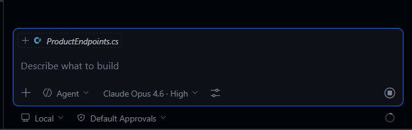

# github-copilot-dev-days-labdotnet_sp-2026-04
Conteúdos do laboratório prático de GitHub Copilot com .NET 10 + Blazor + Visual Studio 2026 ou VS Code.

Exercício prático: **https://dotnet-presentations.github.io/visual-studio-github-copilot-lab/index.html**

Criar na pasta **.vscode** o arquivo **launch.json**:

```json
{
    "configurations": [
        {
            "type": "aspire",
            "request": "launch",
            "name": "Aspire: Launch TinyShop.AppHost",
            "program": "${workspaceFolder}/src/TinyShop.AppHost/TinyShop.AppHost.csproj"
        }
    ]
}
```

Utilizar o **Claude Opus** como modelo:



Instalar o Aspire CLI via bash:

```bash
curl -sSL https://aspire.dev/install.sh | bash
```
